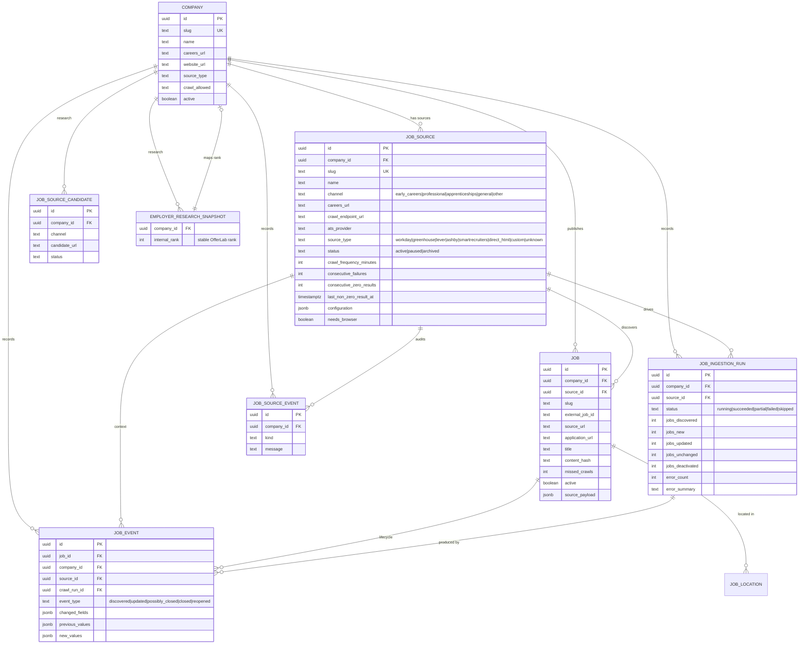

# OfferLab crawler architecture

**Status:** Active implementation reference
**Last reviewed:** 2026-08-15

This document records how the crawler actually works, reviews a proposed
refactor against it, and describes the lifecycle improvements implemented on
2026-08-15. It complements `docs/operations/job-catalog-operations.md`.

## Entities and relationships

## How a crawl works

1. `jobs:crawl:due` (systemd timer every 5 min in production, local poller in
   dev) lists sources where `next_check_at <= now` or a run was requested.
2. Per source: advisory lock, robots.txt gate (`RobotsGate`, 6h cache),
   connector dispatch by `source_type` (native adapters: Workday,
   Greenhouse, Lever, Ashby, SmartRecruiters; `direct_html`; browser
   variants; `custom`).
3. Discovered jobs are validated and normalised (`validateDiscoveredJob`),
   then matched to existing rows by deterministic identity
   (`resolveJobIdentity`: external ATS id when available, otherwise a
   canonical detail-URL fingerprint — never employer+title+location alone).
4. `planCrawlChanges` compares content hashes: unchanged rows are touched
   (last_seen only), changed rows update, new rows insert, missing rows
   increment `missed_crawls` (and deactivate after the configurable
   threshold), reappearing rows reactivate.
5. `applyCrawlPlan` applies the plan in one crawler-role transaction and now
   records per-job lifecycle events (`app.job_event`).
6. The run writes `app.job_ingestion_run` + source events; source health
   counters update.

## Lifecycle rules (invariants)

- **A failed crawl never closes jobs.** DNS, 5xx, parser, browser, robots or
  timeout failures update failure counters and the next-check schedule only.
- **A zero-result successful crawl never closes jobs.** Disappearance logic
  runs only on successful, non-empty listings. Zero-result crawls increment
  `consecutive_zero_results`; a source that previously had active jobs and
  suddenly returns empty with HTTP 200 is flagged (`listing_empty_anomaly`,
  run status `partial`) for manual review — the jobs are not touched.
- **Two-stage disappearance.** An active job absent from one successful
  listing becomes `possibly_closed` (event; `missed_crawls` 0 → 1). Absent
  from a second (threshold 2) it becomes `closed` (event; `active=false`,
  `publication_status='expired'`). A reappearing job with the same external
  identity becomes `reopened` (event; `active=true`).
- **Change detection.** The deterministic content hash covers the
  user-relevant fields; unchanged rows only update `last_seen_at` (no
  `updated` event). Changed rows set `last_changed_at` and record an
  `updated` event with field-level diff (`changed_fields`,
  `previous_values`, `new_values`).
- **Source health ≠ job availability.** A programme landing page can be a
  perfectly healthy source with zero current jobs.

## Review of the proposed crawler refactor (2026-08-15)

An external review proposed: employer master data with immutable `rank`;
`career_sources` (1:N per employer); canonical ATS enums; programmes and
intake cycles; an extended job model; adapter architecture; crawl-run
history; strict "never close on failed crawl"; staged disappearance; job
event history; change detection; conditional fetching; zero-result anomaly
detection; source re-verification; UK scoping; CSV migration; backward
compatibility; admin observability; testing; and documentation.

**Already implemented (adapted, not duplicated):**

| Proposal                           | Existing implementation                                                                                                                         |
| ---------------------------------- | ----------------------------------------------------------------------------------------------------------------------------------------------- |
| Employer master + immutable `rank` | `app.company` + `app.employer_research_snapshot.internal_rank` (rank is research-scoped, never renumbered)                                      |
| `career_sources` 1:N               | `app.job_source` (channel `early_careers`/`professional`/`apprenticeships`/`general`/`other`, per-source schedule, health, configuration JSONB) |
| Canonical ATS enums                | `ats_provider` + `source_type` + `ats-fingerprint.ts` + connector registry                                                                      |
| Adapter architecture               | `connectors/` (typed adapters + registry + errors + http-client + robots)                                                                       |
| Job model                          | `app.job` (external id, source URL, apply URL, content hash, raw payload, missed-crawls counter, enrichment state)                              |
| Crawl-run history                  | `app.job_ingestion_run`                                                                                                                         |
| Never close on failed crawl        | Enforced (failure paths never touch job activity)                                                                                               |
| Staged disappearance               | `missed_crawls` + configurable threshold (2); formalised with events                                                                            |
| Change detection                   | Content-hash compare (`change-detection.ts`)                                                                                                    |
| UK scope                           | UK publication gate, location handling, non-UK suppression                                                                                      |
| CSV migration                      | `jobs:targets:import` (idempotent, rank-preserving, candidate-based)                                                                            |
| Admin observability                | `/admin/job-sources` + `/admin/source-discovery` + `jobs:status`                                                                                |
| Testing                            | Domain unit tests + integration lifecycle tests + E2E                                                                                           |

**Implemented on 2026-08-15 (the genuine gaps):**

1. **Zero-result anomaly tracking** — `app.job_source.consecutive_zero_results`
   and `last_non_zero_result_at`; `zeroResultTrackingAfterSuccessfulCrawl`
   (domain); a source with active jobs that suddenly returns empty flags
   `listing_empty_anomaly` and records the run as `partial`. Zero results
   never invalidate a source and never deactivate jobs.
2. **Per-job lifecycle events** — `app.job_event`
   (`discovered`/`updated`/`possibly_closed`/`closed`/`reopened`) written in
   the ingestion transaction, with field-level diffs for updates. The
   foundation for "new today", "recently updated", "recently closed", job
   alerts and employer update feeds.
3. **Admin visibility** — job sources show consecutive zero results and the
   last non-zero time.

**Intentionally not built (with reasons):**

- **Programmes / programme cycles.** The existing channel model on
  `app.job_source` already represents "one employer, many sources per
  programme type", and `job_source_candidate` already captures per-programme
  URLs from research. A programmes table without ingestion integration would
  be dead weight; the _intake-window_ dimension (opening/closing months) is
  genuinely new and should be added with a discovery integration that writes
  it, not before.
- **Conditional fetching (ETag/If-None-Match).** The HTTP client does not
  currently send conditional headers. Useful efficiency work; tracked as a
  future improvement, not required for correctness.
- **Scheduled source re-verification.** Manual verification exists
  (`jobs:verify-sources`, discovery `--verify`); automation is deferred
  until the verification pipeline has a demonstrated manual cadence.
- **LLM extraction.** Deterministic extraction is used wherever structured
  data exists, per the founder's AI guardrails; LLM remains an optional
  classification/enrichment fallback behind the documented kill switches.
